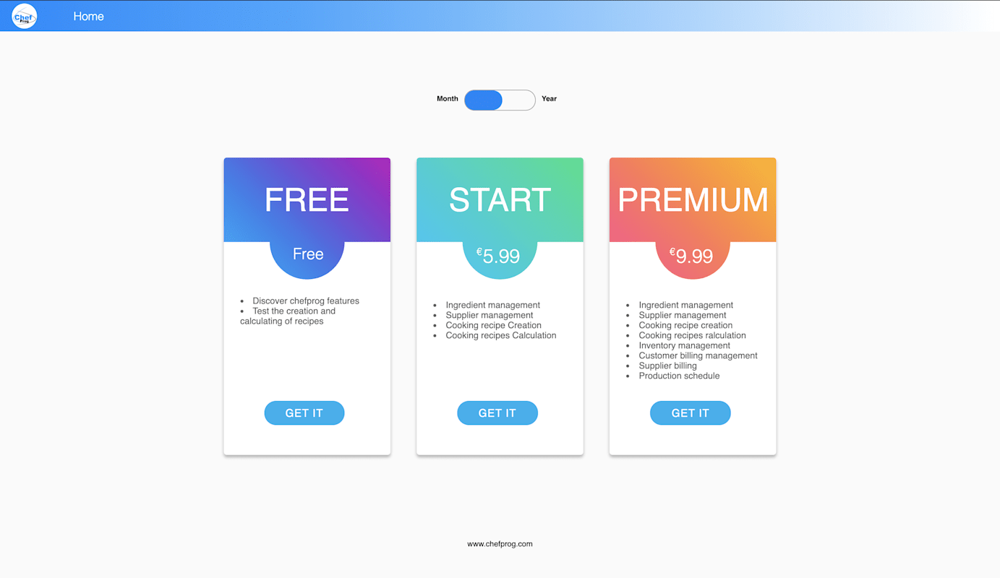
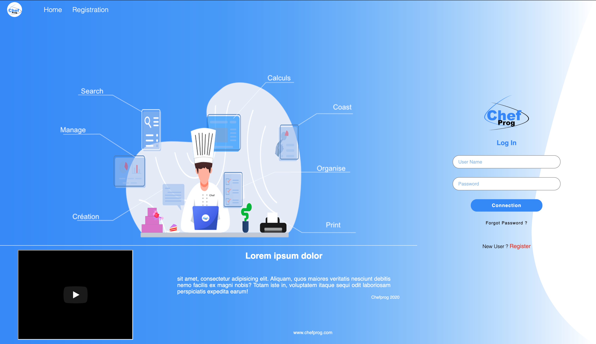

# Fiverr

> Fiverr's freelance projects

## Table of Contents

- [Fiverr](#fiverr)
  - [Table of Contents](#table-of-contents)
  - [General Information](#general-information)
  - [Technologies Used](#technologies-used)
  - [Screenshots](#screenshots)
  - [Project Status](#project-status)
  - [Contact](#contact)

## General Information

- A client commissioned me to build two pages of a website for him.
- He gave me a design for each page and I must built it from scratch to be the same as the given UI.

## Technologies Used

- CSS
- [JS](https://www.javascript.com/)
- HTML

## Screenshots

## Project Status

Project is: _complete_.

## Contact

Created by [@alextison](https://github.com/alextison) - feel free to contact me!
